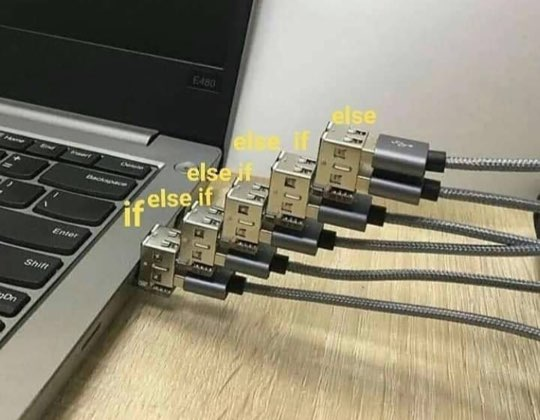

## 💡 Today I Read : https://velog.io/@gomjellie/else-%EC%93%B0%EC%A7%80%EB%A7%88

### #else #cleancode #early *

# 🕳 else의 문제점
- else 자체로는 문제가 안되지만 쓰지 않아도 되는 상황에서 중첩구조를 쓰게 되면 코드가 복잡해진다.



# 💊 elary return
- return 시켜서 뒷 코드를 타지 않도록 한다.

    👇적용 전
    ```Java
    int get_string_type(char* string) {
        int ret;
        if (is_rule_1(string)) {
            ret = 1;
        } else {
            if (is_rule_2(string)) {
                ret ㄴ= 2;
            } else {
                ret = 0;
            }
        }
        return ret;
    }
    ```

    👇적용 후
    ```java
    int get_string_type(char* string){
        if(is_rule_1(string)){
            return 1;
        }
        if(is_rule_2(string)){
            return 2;
        }
        return 0;
    }
    ```    

    💡**if과 return을 함께 사용하여 else 지양**

# 👩‍⚖️ 결론
무조건 if-else를 지양하라는 글은 아니었다. if-else문을 사용하여 명확하게 논리를 드러내는 것이 좋은 방향일 수도 있다고 말한다. 클린코드 책을 읽고 있는데 책에서도 **if문 내 복잡한 조건식이 오지 않게 하며 if-else 대신 if와 return을 사용**할 것을 권한다.

시간이 촉박한 프로젝트를 하다보니 동작하게만 만드려다보니 if-else로 굳이 사용 안해도 될 것 같은 코드도 무작정 써버린 적이 종종 있었다.😅 

잊지말자. 나중은 없으며 지금 해둬야 미래의 나와 내 동료가 고마워 할 것이다!